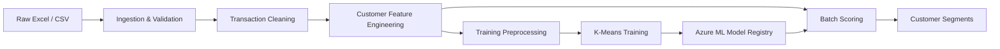

# Azure Retail Customer Segmentation

## Project Overview

This project implements an end-to-end customer segmentation solution using
Azure Machine Learning and unsupervised machine learning.

The solution transforms raw retail transaction data into actionable customer
segments through automated data validation, cleaning, feature engineering,
preprocessing, model training, model registration and batch scoring.

The project was designed to demonstrate a reproducible, production-style
machine learning workflow rather than a standalone modelling notebook.


## Solution Architecture



The training workflow fits and stores the preprocessing artefacts alongside the
K-Means model. The scoring workflow reuses those saved artefacts and the
registered model to ensure incoming customer data is processed consistently
with training.

---

## Business Problem

Retail customers behave differently.

Some purchase frequently, some generate significantly more value, some return
large amounts of merchandise, while others purchase only occasionally or may
have become inactive.

Treating all customers in the same way can result in poorly targeted
engagement, inefficient marketing activity and missed retention opportunities.

The objective is therefore to identify groups of customers with similar
behaviour that can support more informed customer engagement and analysis.

---

## Solution

Customer-level behavioural features are engineered from raw transaction data
and used to train a K-Means clustering model.

The final solution supports two automated workflows:

### Training Pipeline

Raw Excel / CSV  
→ ingestion and schema validation  
→ transaction cleaning  
→ customer feature engineering  
→ feature transformation and scaling  
→ K-Means model training  
→ model artefact packaging  
→ Azure ML model registration

### Batch Scoring Pipeline

New raw Excel / CSV  
→ ingestion and validation  
→ transaction cleaning  
→ customer feature engineering  
→ apply saved preprocessing artefacts  
→ registered K-Means model prediction  
→ customer segment output

The scoring workflow reuses the StandardScaler fitted during training rather
than fitting preprocessing again on incoming data.

---

## Final Model

The selected solution is a six-cluster K-Means model using eight behavioural
features:

- Recency
- Frequency
- Monetary Value
- Unique Products
- Customer Tenure
- Average Quantity per Order
- Postage Invoice Share
- Observed Merchandise Return Value Rate

Model configuration:

- Algorithm: K-Means
- Number of clusters: 6
- Random state: 42
- `n_init`: 50
- Training customers: 4,334

### Clustering Metrics

| Metric | Result |
|---|---:|
| Silhouette Score | 0.2218 |
| Calinski-Harabasz Score | 1387.07 |
| Davies-Bouldin Score | 1.1945 |

Clustering metrics were considered alongside cluster size, behavioural
distinctiveness and business interpretability rather than using a single
metric to select the final solution.

---

## Customer Segments

The final model identified six customer groups:

| Segment | Customers |
|---|---:|
| Active Regular Customers | 1,362 |
| Larger-Basket Low-Frequency Customers | 1,140 |
| Lapsed Low-Value Customers | 847 |
| High-Value Loyal Customers | 669 |
| Postage-Heavy Occasional Customers | 258 |
| High-Return Customers | 58 |

The segment names are business interpretations of the behavioural patterns
identified by the clustering model.

---

## Reproducibility and Validation

The production components were validated against the original modelling
workflow.

The final Azure ML batch scoring pipeline reproduced the validated segmentation
results customer by customer:

- 4,334 customers scored
- Customer IDs matched exactly
- Cluster assignments matched exactly
- Segment names matched exactly
- Adjusted Rand Index: **1.0**

This confirms that the production scoring workflow reproduces the validated
model behaviour.

---

## Model Packaging

The registered Azure ML model is packaged with the preprocessing artefacts
required for consistent future scoring:

```text
model_artifacts/
├── final_kmeans_model.joblib
├── standard_scaler.joblib
├── feature_order.json
├── preprocessing_metadata.json
└── model_metadata.json